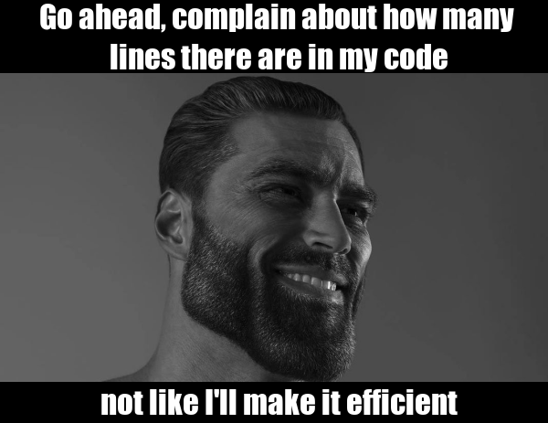

# The Making

I have adopted the 'gigachad' meme in which text is overlayed or added to the bottom or on top of the image of 'gigachad'. '**Gigachad**' is real person that was stumbled upon by the internet is glorified for his physique that displays the pinnacle of what man can achieve and his greek god of a face, for more visit [Know Your Meme](https://knowyourmeme.com/memes/gigachad). The meme itself is to relay the message of peak masculinty and they care to do whatever one wants. I wanted to show that in coding there are lots of ways to make your code more efficient but it does not mean it needs to be, therefore: 

1. I do not care about your complaints.

2. I do not care about your complaints.

3. I do not care about your complaints.

## The Sauce
```r
library(magick)

gigachad <- image_read("https://i.kym-cdn.com/entries/icons/facebook/000/026/152/gigachad.jpg") %>% 
  image_scale(600)

top_text <- image_blank(width= 600, 
                    height = 80,
                    color = "#000000")%>%
  image_annotate(text = "  Go ahead, complain about how many \n  lines there are in my code",
                 color = "#FFFFFF",
                 size = 35,
                 font = "Impact",
                 gravity = "center")

bottom_text <- image_blank(width= 600, 
                          height = 45,
                          color = "#000000")%>%
  image_annotate(text = "  not like I'll make it efficient",
                 color = "#FFFFFF",
                 size = 35,
                 font = "Impact",
                 gravity = "center")

gigachad_meme <- c(top_text, gigachad, bottom_text) %>%
  image_append(stack = TRUE)


image_write(gigachad_meme, "my_gigachad_meme.png")
```
## The Meme


